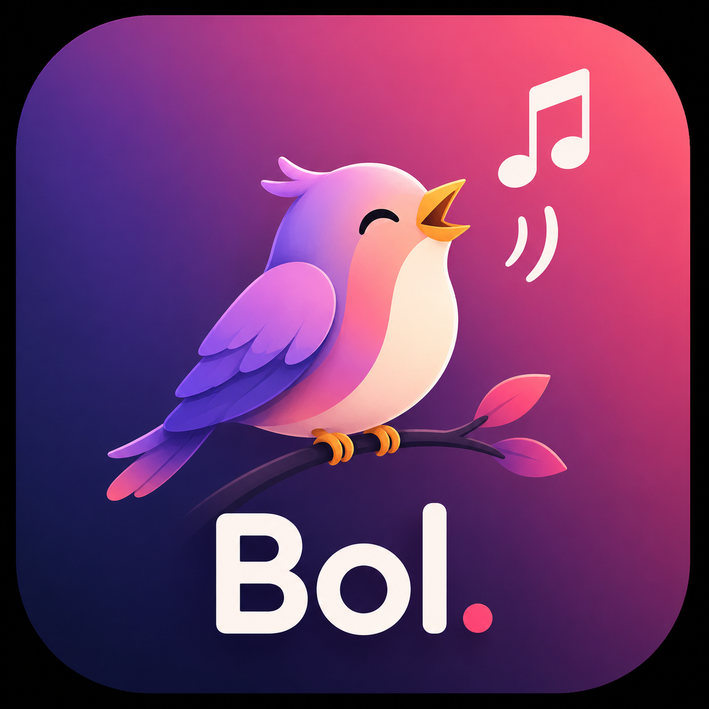

# Bol — Lyrics for YouTube

<p align="center">
  
</p>

**Accurate, beautifully synced lyrics for YouTube music — built for Indian music.**

Bol is a Chrome extension that shows line-by-line synced lyrics beside any YouTube
music video, like a premium music app. It was built to solve a specific frustration:
YouTube's captions for Hindi, Punjabi, Tamil, and other Indian music are often
mistranscribed or badly timed — while accurate, community-synced lyrics already
exist elsewhere.

## Features

- 🎤 **Synced lyrics** — the current line highlights and scrolls as the song plays,
  with a large, readable "now playing" stage
- 🇮🇳 **Built for Indian music** — Hindi, Punjabi, Tamil, Telugu, Kannada,
  Malayalam, Bengali (plus Korean and Japanese kana)
- 🔤 **Automatic romanization** — sing along even if you can't read the script;
  switch between Original / Romanized / Both
- 🧠 **Smart song matching** — handles messy YouTube titles ("(Official Video)",
  "| New Punjabi Song 2026"), slowed + reverb edits (timestamps rescaled),
  sped-up versions, and live performances
- 🎨 **Native-feeling panel** — glassmorphic side panel that docks next to the
  video without ever covering it, with a collapsible thin tab and `Alt+L` toggle
- 🔒 **Private by design** — no accounts, no analytics, no tracking
  ([privacy policy](PRIVACY.md))

## Install

**Chrome Web Store:** _coming soon_

**From source (load unpacked):**

```bash
git clone https://github.com/MEET1607/Bol---Lyrics-for-YouTube.git
cd Bol---Lyrics-for-YouTube
npm install
npm run build
```

Then open `chrome://extensions`, enable **Developer mode**, click **Load unpacked**,
and select the `dist/` folder. Open any YouTube music video and click the Bol icon
(or press `Alt+L`).

## How it works

```
YouTube watch page
      │  video title + channel + duration (oEmbed, DOM fallback)
      ▼
Metadata normalizer          strips noise, detects slowed/live/remix modifiers
      ▼
Provider chain (parallel)    LRCLIB → NetEase, multi-strategy search per provider
      ▼
Match validation             similarity scoring + duration corroboration
                             (wrong lyrics are treated as worse than no lyrics)
      ▼
Romanization                 per-script transliteration (sanscript + custom RR)
      ▼
Synced panel                 React + Framer Motion stage, driven by video.currentTime
```

Key design decisions:

- **Lyrics sources**: [LRCLIB](https://lrclib.net) (primary, open lyrics database
  with community-synced timestamps) with NetEase Cloud Music as fallback, behind a
  pluggable provider interface (`src/lib/providers/`). Adding a provider is one
  file + one registry line.
- **Cross-provider canonical resolution**: if one provider identifies the song but
  has no lyrics, its canonical track/artist name re-queries the other — this solves
  "YouTube title ≠ catalog title" mismatches.
- **Tempo-edit support**: slowed/sped-up uploads match the original recording and
  linearly rescale every timestamp by the duration ratio.
- **Never show wrong lyrics**: risky fragment matches require both textual
  corroboration and duration agreement before they are accepted.

## Development

```bash
npm install
npm run watch:js    # esbuild in watch mode (verbose dev logging enabled)
npm run watch:css   # tailwind in watch mode
npm run build       # production build into dist/
```

Reload the extension at `chrome://extensions` and refresh the YouTube tab after
changes. Pipeline diagnostics (every search query, score, and rejection reason)
are logged in the background service worker console.

Project documents: [PRD](PRD.md) · [Architecture](ARCHITECTURE.md) ·
[Data flow](DATA_FLOW.md) · [Extension spec](EXTENSION_SPEC.md)

## Disclaimers

- Bol is an independent project, not affiliated with or endorsed by YouTube/Google.
- Lyrics are fetched from third-party community databases; coverage and accuracy
  depend on those sources. The NetEase fallback uses an unofficial endpoint that
  may stop working without notice.

## License

[MIT](LICENSE)
